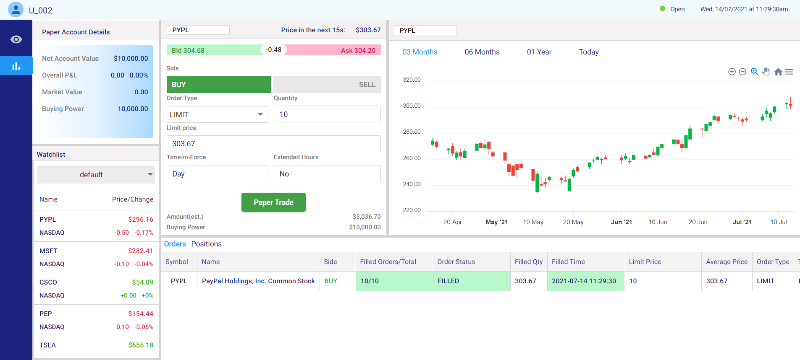

<h3>Fidcoin Stock Trading · <a href="http://fidcoin-stocktrading.s3-website.us-east-2.amazonaws.com">Live Demo</a></h3>
</div>

<!-- TABLE OF CONTENTS -->
<details open="open">
  <summary>Table of Contents</summary>
  <ol>
    <li>
      <a href="#about-the-project">About The Project</a>
      <ul>
        <li><a href="#built-with">Built With</a></li>
        <li><a href="#built-with">Features</a></li>
      </ul>
    </li>
    <li>
      <a href="#getting-started">Getting Started</a>
      <ul>
        <li><a href="#prerequisites">Prerequisites</a></li>
        <li><a href="#installation">Installation</a></li>
      </ul>
    </li>
    <li><a href="#usage">Usage</a></li>
  </ol>
</details>


<!-- ABOUT THE PROJECT -->
## About The Project
Fidcoin stock trading is a web app that allows multiple users to practice trade stocks during market's opening time (9:30am - 4:00pm) on Wed, 14 July 2021 without using real money. A new user is given a default account with $10,000 virtual money and a watchlist of 05 random stocks. When the market closes at 4:00pm every day, all the orders are reset (deleted) so that user can restart the next day.

Due to the scope of this project, I couldn't purchase a paid account to get realtime data from broker platforms. My solution is to get historical data of 14/07/21 and let users only trade on that day. Data from backend is sent to frontend via websocket instead of http requests.



### Built With
* Java 11
* Spring Boot 5.3.6
* Hibernate
* MySQL
* Angular 11
* StompJS
* ApexChart.js
* YahooFinance
* Amazon Web Services (S3, EC2, NGINX)

### Features
* Execute market and limit orders. For limit orders, if the price reaches the pre-defined, the order will be filled and converted its status from "working" to "filled".


* Display the position of owned stocks, including their realtime P/L based on their current market value.


* If there's a new order, change in stock prices, account is immediately updated.


* Allow multiple users trading at the same time.


* When a user (e.g., U_001) purchases a stock (e.g AMZN), other users (e.g., U_002, U_003) will get a notification about U_001's transaction (e.g "U_001 has just purchased AMZN"). This feature is built by design pattern "Observable".


* Automatically schedule to cancel(delete) orders when the market closes at 4:00pm on every day without restarting the server.


* Display candle charts by using data from YahooFinance library to get historical quotes and ApexCharts.js to display the chart.


* Build a watchlist to track favourite companies. Perform CRUD (create, read, update, delete) operations and display realtime stock prices in the watchlist.


* Follow news related to the watchlist. 


* Deploy frontend and backend on Amazon Web Service using S3, NGINX, and EC2.

## Getting Started

### Installation

* clone the repo
   ```sh
   git clone https://github.com/trangntt-016/stocktrading.git
   ```

* start front end
  ```sh
  cd frontend
  ```
  ```sh
  npm install
  ```
  ```sh
  ng serve
  ```
* start backend
  ```sh
  cd backend/src/main/java/com/canada/edu/stocktrading
  ```
    ```sh
  Right click on StockTradingApplication.java
  ```

## Usage

Visit website: http://fidcoin-stocktrading.s3-website.us-east-2.amazonaws.com/

Register and login or you can login with email "user@gmail.com", password: "abc123456". Note: Only new users are given default watchlist with 05 symbols and $10,000 virtual money. "user@gmail.com" is a used one.

Buy and sell stocks: In order to test how the order is filled, there's a button "Show matched price" which shows the price of current stocks in the next 15s, click on it and filled in the limit price. This only applies to OrderType Limit.

View the profit and lost of the account: It is updated in the account block.

View the positions of the owned stocks: It is updated in the position table.

<!-- ACKNOWLEDGEMENTS -->
## Acknowledgements
* [YahooFinance](https://www.webpagefx.com/tools/emoji-cheat-sheet)
* [RapidApi](https://shields.io)
